# Andova — Advanced Remote Administration & Parental Control

<p align="center">
  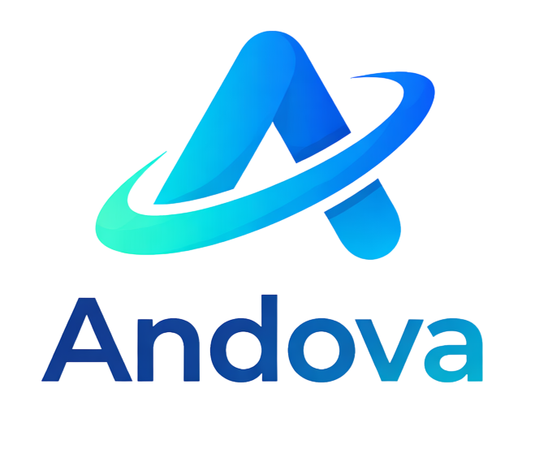
</p>

[](https://advanced.andova.online/)
[](https://github.com/andovaApp/andova-website)
[](#run-locally)

**Andova** is an advanced, consent-based remote administration and parental control platform for managing authorized Android devices. It gives families and administrators a clear web control panel for device visibility, digital safety, security audits, and remote device tools.

> **Live product:** [advanced.andova.online](https://advanced.andova.online/)
>
> Use Andova only on devices you own or are explicitly authorized to manage. Responsible use, informed consent, privacy, and applicable law come first.

## What Andova does

Andova keeps the important tools for a connected device in one place. From a phone or desktop browser, an authorized user can connect to a paired device, review available activity, and use the management features enabled for that device.

- **Stay informed:** understand screen time, app activity, device status, location, and browsing activity.
- **Stay connected:** check in on an authorized smartphone and use its available device tools remotely.
- **Manage from anywhere:** access the dashboard wherever you are, once the device has been installed, paired, and permissioned.
- **Keep control clear:** use a GUI-based dashboard with real-time device state and activity views.

## Capabilities

The live Andova product page currently presents these capability areas. Availability depends on the device, permissions, account, plan, and deployment configuration.

### Device visibility and monitoring

- Live screen view
- Device status and secure connection state
- Device and system information
- Activity and data overview
- App management and app-activity visibility
- Contacts, call-log, SMS, and notification views
- Clipboard and download access where explicitly authorized

### Remote device tools

- File manager
- Launch URL
- Wallpaper modification
- Audio control
- Torch control
- Vibration control
- Text-to-speech
- Camera access for authorized safety checks
- Recording controls where lawful and explicitly consented to
- Advanced tools and administrator controls

### Security and administration

- Secure device pairing and permission setup
- Encrypted connection messaging
- Admin panel for authorized users
- Real-time connected-device dashboard
- Privacy, terms, and responsible-use documentation
- Support for family safety, digital well-being, and security-audit workflows

## How it works

1. **Log in** — access the authorized Andova account.
2. **Build** — create the device app with the required configuration.
3. **Install and pair** — install it on an authorized Android device and complete pairing and permission setup.
4. **Manage** — use the dashboard features enabled for the connected device.

The dashboard is designed for straightforward remote care: connect an authorized device, confirm its status, choose a management area, and review the available information or action.

## Product screenshots

These are the real product images included with the live website. They are arranged in a responsive four-column gallery on wide screens and wrap naturally on smaller screens. Click any image to open the full-size version.

<div align="center">
  <a href="img/slide2.png">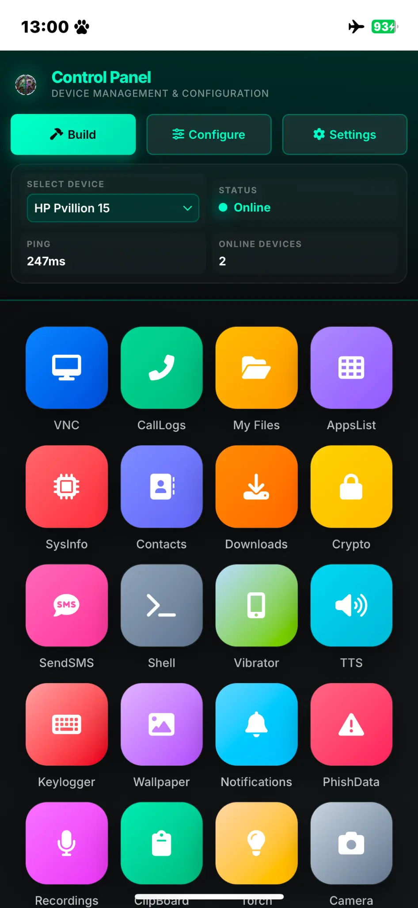</a>
  <a href="img/slide13.jpg">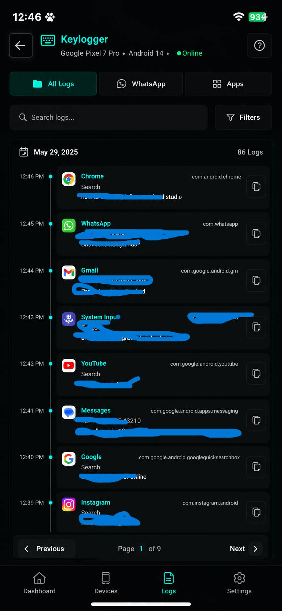</a>
  <a href="img/slide3.png">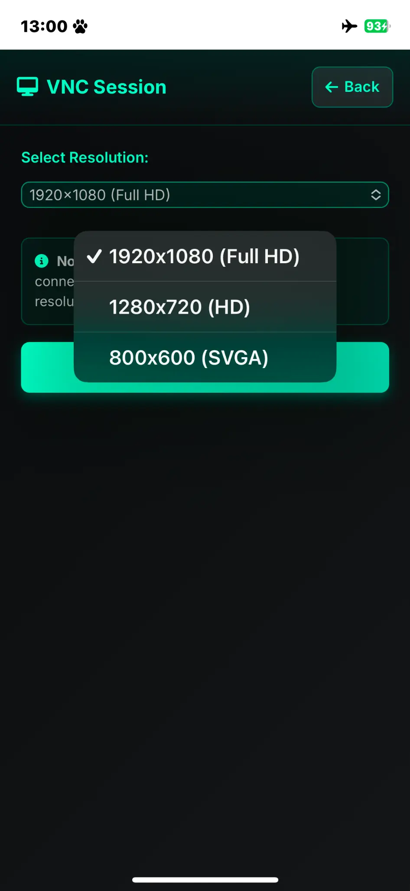</a>
  <a href="img/slide5.jpg">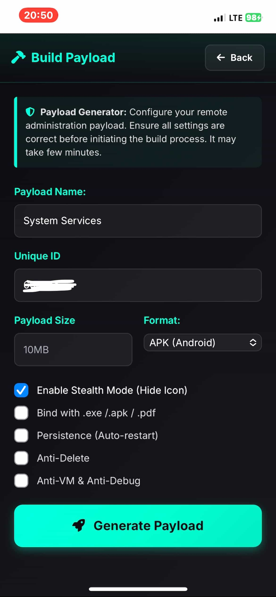</a>
</div>

<p align="center"><sub><strong>01 Dashboard</strong> · <strong>02 Device controls</strong> · <strong>03 Monitoring</strong> · <strong>04 Administration</strong></sub></p>

<div align="center">
  <a href="img/slide6.jpg">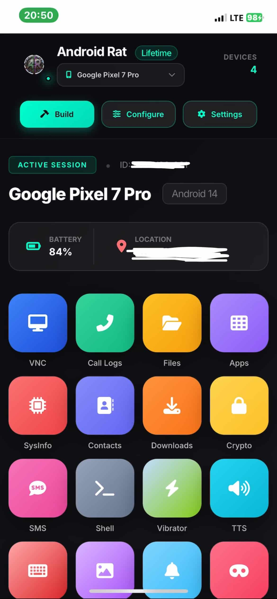</a>
  <a href="img/slide4.jpg">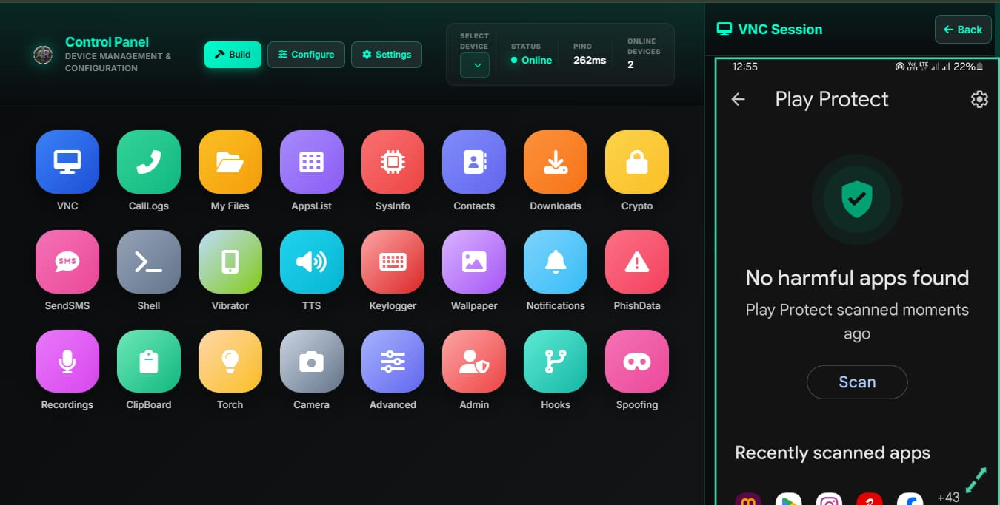</a>
  <a href="img/slide8.jpg">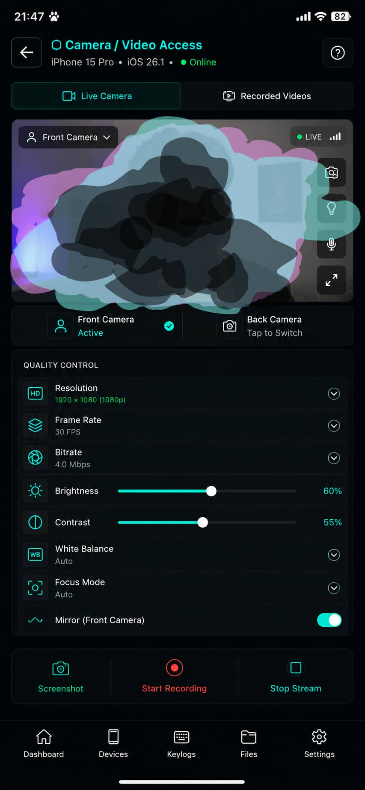</a>
  <a href="img/slide9.jpg">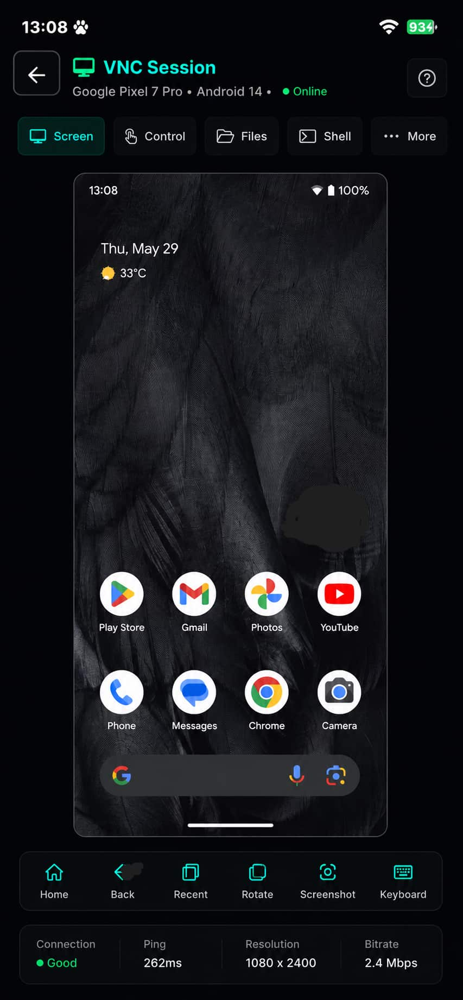</a>
</div>

<p align="center"><sub><strong>05 Device management</strong> · <strong>06 Family safety</strong> · <strong>07 Advanced tools</strong> · <strong>08 Remote management</strong></sub></p>

<div align="center">
  <a href="img/slide10.jpg">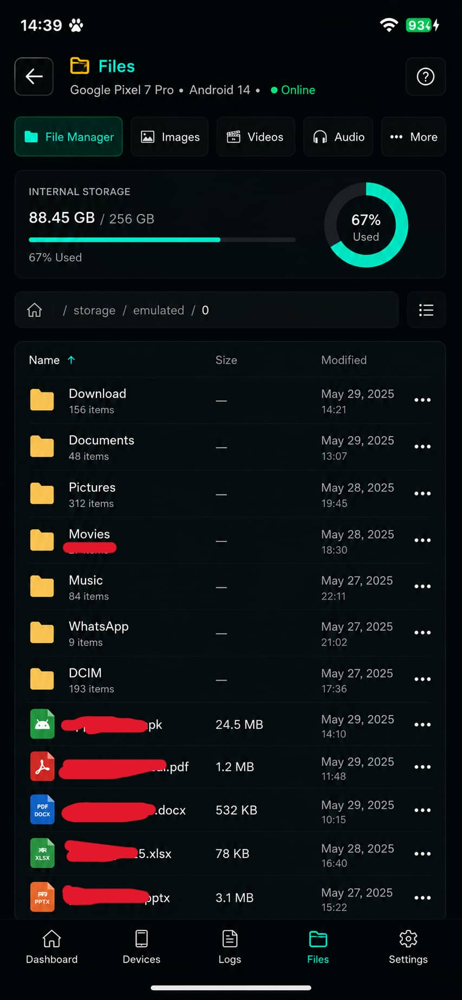</a>
  <a href="img/slide12.jpg">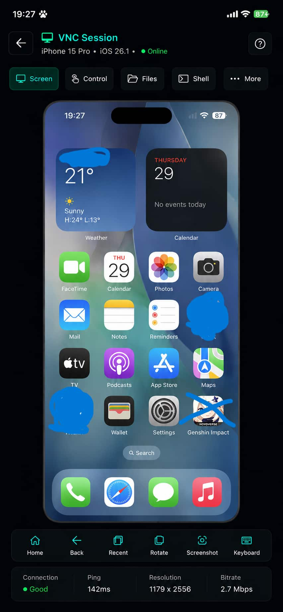</a>
</div>

<p align="center"><sub><strong>09 Connected device workflow</strong> · <strong>10 Admin dashboard</strong></sub></p>

## Plans shown on the live site

The live website presents three access options. Check [advanced.andova.online](https://advanced.andova.online/) for current pricing, availability, and terms before making any decision.

- **Premium** — 7 months of access, all listed features, Android and Windows support, up to 10 devices, bandwidth limits, and priority support.
- **Lifetime** — permanent access, cross-platform options, source-code access, custom modifications, priority support, unlimited bandwidth, and lifetime updates.
- **Complete Package** — lifetime access plus a making course, tutorials, guides, build-from-scratch material, and private workshop access.

## This repository

This repository contains the production static website and public product presentation for Andova. It includes:

- Responsive homepage and product landing page
- Full capabilities, how-it-works, pricing, and contact sections
- Android safety and parental-control blog
- Privacy policy, terms of service, and disclaimer pages
- Real product images, logos, favicons, and PWA manifests
- `robots.txt` and `sitemap.xml`
- Canonical URLs, Open Graph previews, Twitter cards, structured data, and search metadata
- Visitor analytics client for the live site and a repository visitor badge

The remote-control backend, authenticated dashboard services, payment processing, device build service, and API infrastructure are deployment-specific and are not included in this static website repository.

## Project structure

```text
.
├── index.html                 # Main Andova product page
├── blog/blog.html             # Safety and parental-control blog
├── legal/                     # Privacy, terms, and disclaimer pages
├── img/                       # Logos, screenshots, and favicons
├── manifest.json              # PWA manifest
├── site.webmanifest           # Alternate PWA manifest path
├── visitor.js                 # Live-site visitor analytics client
├── robots.txt                 # Crawler rules
├── sitemap.xml                # Public URL sitemap
├── .gitignore
└── README.md
```

## Run locally

This is a static site. It has no build step and requires no package installation.

```bash
git clone https://github.com/andovaApp/andova-website.git
cd andova-website
python3 -m http.server 8080
```

Open <http://localhost:8080/> in a browser.

## Production deployment

Deploy the repository root with GitHub Pages, Cloudflare Pages, Netlify, or another static hosting provider. Configure the production custom domain as:

```text
advanced.andova.online
```

Preserve these public files and paths:

- `/robots.txt`
- `/sitemap.xml`
- `/manifest.json`
- `/site.webmanifest`
- `/blog/blog.html`
- `/legal/privacy.html`
- `/legal/terms.html`
- `/legal/disclaimer.html`

After deployment, verify that the canonical URLs, sitemap entries, Open Graph URLs, and site links all use `https://advanced.andova.online/`.

## Search readiness

The public pages include meaningful initial HTML, descriptive titles, route-specific descriptions, canonical URLs, crawl rules, a sitemap, Open Graph metadata, Twitter cards, structured data, descriptive image alt text, and internal links. Add a sitemap entry whenever a new indexable public page is introduced.

Search visibility is not a ranking guarantee. Indexing and ranking depend on crawl discovery, content quality, site performance, authority, backlinks, competition, and search-engine policies.

## Responsible use and security

Andova is intended only for lawful, authorized, consent-based device management and family safety. Do not use it for covert surveillance, unauthorized access, credential theft, harassment, or any activity that violates privacy or law.

- Obtain clear permission from the device owner before installation and pairing.
- Explain what data is collected, why it is needed, and who can access it.
- Use least-privilege permissions and remove access when it is no longer needed.
- Do not collect, log, or transmit plaintext passwords or private keys.
- Keep authenticated dashboards, payment flows, build endpoints, and private APIs out of search indexing.
- Configure server-side analytics, retention, access controls, and privacy notices before enabling production endpoints.

## Public links

- Website: [advanced.andova.online](https://advanced.andova.online/)
- Blog: [Andova Blog](https://advanced.andova.online/blog/blog.html)
- Privacy: [Privacy Policy](https://advanced.andova.online/legal/privacy.html)
- Terms: [Terms of Service](https://advanced.andova.online/legal/terms.html)
- Disclaimer: [Disclaimer](https://advanced.andova.online/legal/disclaimer.html)
- Community: [Telegram](https://t.me/jrram3000)
- Support: [team@andova.online](mailto:team@andova.online)
